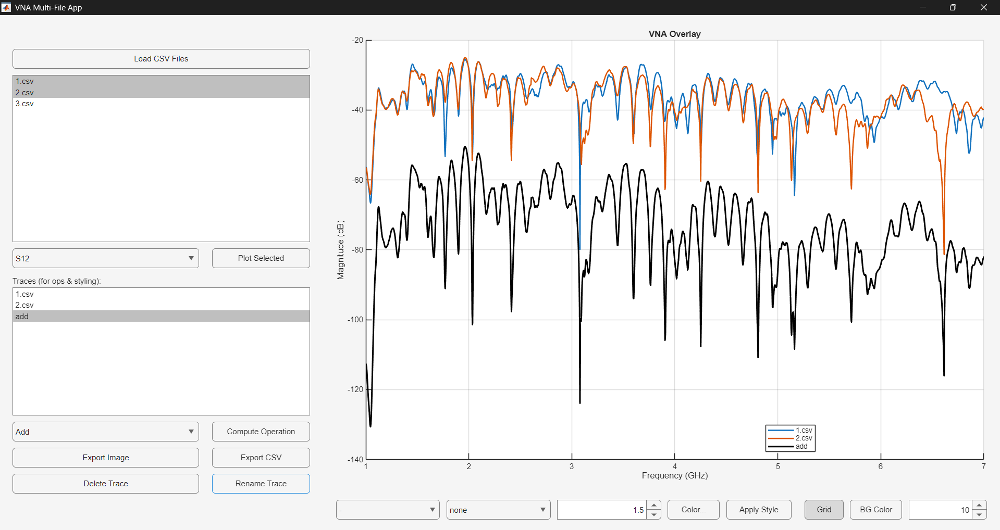
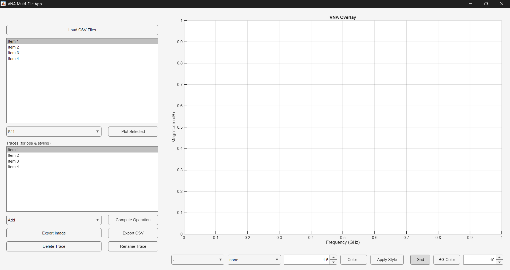
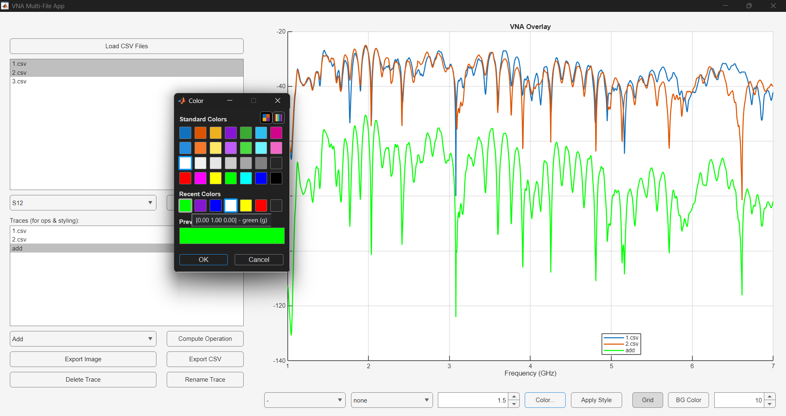
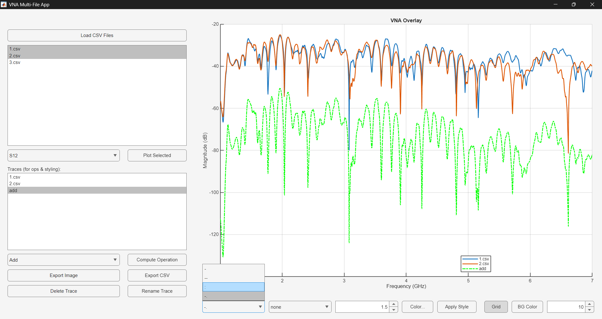
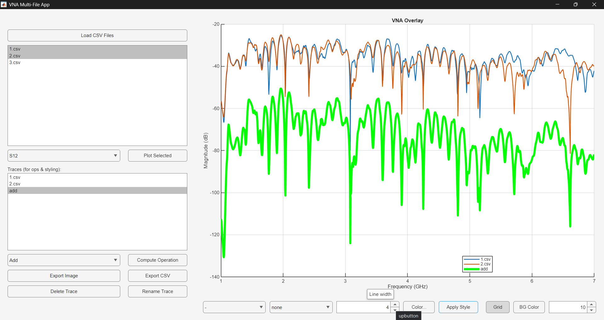
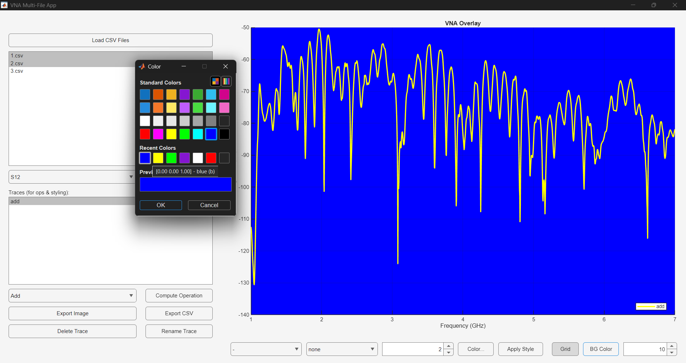

# VNA Plotter (VNA Multi-File App)

A MATLAB-based GUI tool for visualizing and comparing multiple Vector Network Analyzer (VNA) CSV traces.

##  Overview

This project provides an interactive application to:

- Load multiple CSV files (VNA traces)
- Select S-parameter (S11, S12, S21, S22) for display
- Overlay traces on a single VNA plot
- Apply trace operations (Add, Subtract, Multiply, Divide, etc.)
- Customize line style, marker, color, width per trace
- Enable grid and change background color
- Export plotted image and processed CSV
- Rename/delete traces

##  GUI Layout

1. Left panel
   - CSV file list
   - Load button
   - S-parameter dropdown
   - Plot Selected button
   - Trace list for operations and style
   - Operation selection
   - Export and trace management buttons

2. Right panel
   - Large overlay chart
   - X-axis: Frequency (GHz)
   - Y-axis: Magnitude (dB)
   - Legend for each trace

3. Bottom panel
   - Trace style controls (line style, marker, width, color)
   - Grid toggle
   - Background color toggle

##  Key Features

- Multi-file overlay for fast visual comparison
- Per-trace styling (color, width, marker, line type)
- In-app operation trace creation (example result: `add` trace)
- Export + image snapshot generation
- CSV export of computed results

##  Screenshots

1. Main file load and S-parameter plotting view

   

2. Empty startup state (no data loaded)

   

3. Color selector and line style controls in action

   

4. Operation trace (`add`) with dotted line style selected

   

5. Line width control demonstration

   

6. plot with changed background color

   

##  Running (MATLAB File)

1. Open MATLAB
2. Open `VNA_MultiPlotApp.m`
3. Run script with `F5` or `Run`
4. Use GUI buttons to load and analyze CSV VNA data
5. Export into csv or image

##  Running (Standalone App)

1. Open VNAPlotter.exe in VNAPlotter/output/build
2. Use GUI buttons to load and analyze CSV VNA data
3. Export into csv or image

##  Recommended workflow

1. Load CSV files
2. Set an S-parameter and click `Plot Selected`
3. Pick trace(s) in trace list for operation
4. Select `Add` / `Subtract` / etc. and `Compute Operation`
5. Style resulting trace with line settings
6. Use `Export Image` / `Export CSV` for final output

##  Future Enhancements

- gibe ideas T_T

---

